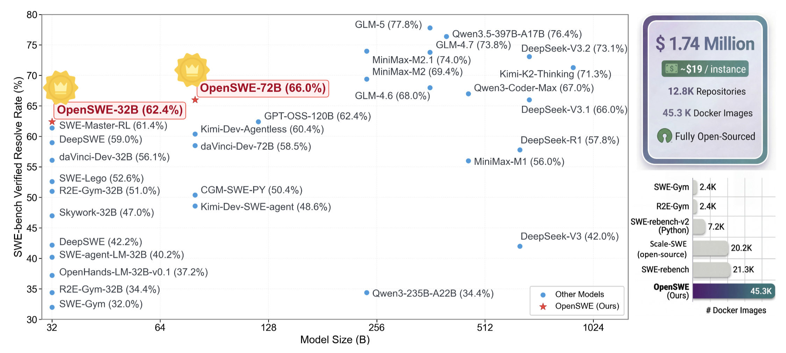

<div align="center">

# OpenSWE: Efficient SWE Environment Synthesis at Scale

<div align="center">

[](https://github.com/GAIR-NLP/OpenSWE/blob/main/asset/paper.pdf)
[](https://arxiv.org/pdf/2603.13023)
[](https://github.com/GAIR-NLP/OpenSWE)
[](https://huggingface.co/datasets/GAIR/OpenSWE)
[](https://huggingface.co/GAIR/OpenSWE-72B)

</div>

<p align="center">  </p>
</div>

OpenSWE is the largest fully transparent framework for SWE agent training in Python, comprising **45,320 executable Docker environments** spanning over **12.8k repositories**, with all Dockerfiles, evaluation scripts, and infrastructure fully open-sourced for reproducibility. OpenSWE is built through a multi-agent synthesis pipeline deployed across a 64-node distributed cluster, automating repository exploration, Dockerfile construction, evaluation script generation, and iterative test analysis. Beyond scale, we propose a quality-centric filtering pipeline that characterizes the inherent difficulty of each environment, filtering out instances that are either unsolvable or insufficiently challenging and retaining only those that maximize learning efficiency. With \$891K spent on environment construction and an additional \$576K on trajectory sampling and difficulty-aware curation, the project yields about **13,000 curated trajectories** from roughly **9,000 quality-guaranteed environments**.

This repository contains the official implementation of the OpenSWE pipeline—an extensible SWE-bench–like dataset generation framework that supports custom data schemas, parallel multi-machine building, and full evaluation integration with SWE-agent / SWE-bench-fork (with provided patches).

## Highlights

- **Unprecedented Scale with Full Transparency**: We release 45,320 executable environments from 12.8k repositories at a construction cost of \$891K, with complete infrastructure including all Dockerfiles, evaluation scripts, and the distributed synthesis pipeline, enabling reproducibility and community-driven improvements.

- **Quality-Centric Filtering via Difficulty-Aware Curation**: A filtering pipeline characterizes environment difficulty to filter out unsolvable and trivially simple instances (e.g., PR–Issue misalignment, triviality). With an additional \$576K investment in trajectory sampling and curation, we obtain about 13,000 curated trajectories from roughly 9,000 high-quality environments.

- **Strong Empirical Validation**: OpenSWE-32B and OpenSWE-72B achieve **62.4%** and **66.0%** on SWE-bench Verified, establishing SOTA among SFT-based methods in the Qwen2.5 series. Models trained on OpenSWE consistently outperform SWE-rebench across all scales and scaffolds, with a log-linear data scaling trend showing no saturation, and SWE-focused training yields substantial out-of-domain improvements (e.g., up to 12 points on MATH-500, 5+ on science benchmarks) without degrading factual recall.

<!-- <div align="center">
<p align="center">  </p>
</div> -->

## News

- **Paper**: OpenSWE (daVinci-Env) introduces the largest fully transparent SWE environment synthesis framework, with multi-agent pipeline design and scaling/curation analysis.

- **SOTA**: OpenSWE-32B / OpenSWE-72B set new SOTA among Qwen2.5 SFT methods on SWE-bench Verified (62.4% / 66.0%).

## Performance

<div align="center">

**Environment scale comparison**

| Dataset                  |  # Repos  | # Images  |  # Tasks  |  Source   |
| :----------------------- | :-------: | :-------: | :-------: | :-------: |
| R2E-Gym (Subset)         |    10     |   2.4k    |   4.6k    | Synthetic |
| SWE-gym                  |    11     |   2.4k    |   2.4k    |   Real    |
| SWE-rebench              |   3.5k    |   21.3k   |   21.3k   |   Real    |
| SWE-rebench (filtered)   |   3.3k    |   18.8k   |   18.8k   |   Real    |
| Scale-SWE                |   5.2k    |   100k    |   100k    |   Real    |
| Scale-SWE (open-sourced) |   1.2k    |   20.2k   |   20.2k   |   Real    |
| **OpenSWE (ours)**       | **12.8k** | **45.3k** | **45.3k** | **Real**  |

**SWE-bench Verified (Pass@1)**

| Model                  | Backbone                | Scaffold  |  Score   |
| :--------------------- | :---------------------- | :-------: | :------: |
| SWE-Master-32B-RL      | Qwen2.5-Coder-32B-Inst. |  R2E-Gym  |   61.4   |
| daVinci-Dev-32B        | Qwen2.5-32B-Base        | SWE-Agent |   56.1   |
| **OpenSWE-32B (Ours)** | Qwen2.5-32B-Base        | OpenHands |   59.8   |
| **OpenSWE-32B (Ours)** | Qwen2.5-32B-Base        | SWE-Agent | **62.4** |
| daVinci-Dev-72B        | Qwen2.5-72B-Base        | SWE-Agent |   58.5   |
| **OpenSWE-72B (Ours)** | Qwen2.5-72B-Base        | OpenHands |   65.0   |
| **OpenSWE-72B (Ours)** | Qwen2.5-72B-Base        | SWE-Agent | **66.0** |

**Impact of environment source (SWE-bench Verified Pass@1)**

| Training Data         | SWE-Agent 32B | SWE-Agent 72B | CodeAct 32B | CodeAct 72B |
| :-------------------- | :-----------: | :-----------: | :---------: | :---------: |
| SWE-rebench           |     50.2%     |     63.4%     |    51.4%    |    62.4%    |
| **OpenSWE**           |   **62.4%**   |   **66.0%**   |  **59.8%**  |  **65.0%**  |
| SWE-rebench + OpenSWE |     61.4%     |     68.0%     |    60.3%    |    65.5%    |

</div>

Training on OpenSWE alone yields large improvements over SWE-rebench across all model sizes and scaffolds; combining with SWE-rebench further improves 72B (e.g., 68.0% SWE-Agent). Data scaling analysis shows log-linear improvement with no saturation (see paper for curves). General capability evaluation shows gains on code (e.g., HumanEval +29), math (e.g., MATH-500 +12.2 for 72B), and science benchmarks without degrading factual recall.

## Quick Start

Use the section that matches your goal:

- If you want to use the released OpenSWE data directly, jump to [Use Released Data](#1-use-released-data).
- If you want to build your own dataset, start from [Build Your Own Dataset](#2-build-your-own-dataset).
- If you want to integrate OpenSWE environments into SWE-bench evaluation, see [Update SWE-bench Evaluation](#5-update-swe-bench-evaluation).

### 1. Use Released Data

If you want to directly use the released OpenSWE dataset, start from this section and skip the dataset collection step in [Build Your Own Dataset](#2-build-your-own-dataset).

1. Download the release from [GAIR/OpenSWE](https://huggingface.co/datasets/GAIR/OpenSWE)
2. Choose the dataset file that matches your use case:
   - `openswe_oss.jsonl`: We have fully open-sourced all repositories whose licenses allow redistribution, including MIT, Apache, GPL, and BSD licenses.
   - `openswe_other.jsonl`: For repositories that cannot be directly open-sourced, we provide the corresponding Dockerfile and evaluation scripts instead.

   > During for environment execution and grading, SWE-bench only uses these two components, the Dockerfile and the evaluation script, to assess your agent rollout result. If you want to verify whether the environment you built is correct for instances in `openswe_other.jsonl`, you should use the method provided in the [daVinci-Dev pipeline](https://github.com/GAIR-NLP/daVinci-Dev#pipeline), obtain the corresponding gold patch for each task, and fill the retrieved gold patch into the dataset.

3. After choosing the dataset file, you can build Docker image with [`scripts/build_images.py`](scripts/build_images.py). Then continue with [Update SWE-bench Evaluation](#5-update-swe-bench-evaluation)

### 2. Build Your Own Dataset

If you want to build your own dataset for OpenSWE, collect the source repositories, patches, and task metadata yourself, then convert them into JSONL. OpenSWE expects each sample to follow this schema:

| Field               | Type  | Description                                                 |
| ------------------- | ----- | ----------------------------------------------------------- |
| `instance_id`       | `str` | Unique identifier for the sample.                           |
| `repo`              | `str` | Full GitHub repo name (e.g., `psf/requests`).               |
| `base_commit`       | `str` | SHA of the commit immediately before the PR's first change. |
| `end_commit`        | `str` | SHA of the final commit in the PR.                          |
| `problem_statement` | `str` | Issue description or problem to solve.                      |
| `patch`             | `str` | Diff of changes to functional (non-test) code.              |
| `test_patch`        | `str` | Diff of changes to the test suite.                          |
| `language`          | `str` | Primary programming language of the repo.                   |

When preparing your own dataset, you should also keep enough original source information to verify that the collected patches and commits are correct.

### 3. Prepare the Runtime Environment

Before running OpenSWE, prepare the following:

- A repo cache directory containing the target repositories, referenced by `SETUP_DIR`
- A dataset JSONL file, referenced by `DATA_PATH`
- Output directories for logs and results, referenced by `OUTPUT_DIR` and `RESULT_DIR`
- API credentials for the model backend you want to use
- Prebuilt `openswe-*` Docker base images

OpenSWE Dockerfiles are expected to inherit from prebuilt `openswe-*` images. Build them before running the pipeline:

```bash
pip install -r requirements.txt
python scripts/prepare_baseimg.py
```

### 4. Configure and Verify

First verify your setup on one sample:

```bash
bash examples/run_one.sh
```

Then run a full dataset build:

```bash
bash examples/run.sh
```

What to check during verification:

- `scripts/prepare_baseimg.py` completed successfully and the `openswe-*` images exist locally
- `DATA_PATH` points to a valid JSONL file
- `SETUP_DIR` points to the repo cache directory
- OpenSWE can write outputs under `OUTPUT_DIR` and `RESULT_DIR`
- A single run finishes and generates `Dockerfile`, `eval.sh`, and result artifacts for the sample

For multi-machine building, see [Parallel Task Execution System](./scripts/parallel).

### 5. Update SWE-bench Evaluation

Before running evaluation with SWE-agent and SWE-bench-fork, apply the provided patches:

- `scripts/swe-agent.patch` for [SWE-agent/SWE-agent](https://github.com/SWE-agent/SWE-agent): adds `skip_fetch` and OpenSWE instance fields
- `scripts/swe-bench-fork.patch` for [SWE-rebench/SWE-bench-fork](https://github.com/SWE-rebench/SWE-bench-fork): adds `eval_script` support and `OPENSWE_EXIT_CODE` grading

Replace `/path/to/openswe` with your OpenSWE repo root:

```bash
cd /path/to/swe-agent
git apply /path/to/openswe/scripts/swe-agent.patch

cd /path/to/swe-bench-fork
git apply /path/to/openswe/scripts/swe-bench-fork.patch
```

If the upstream SWE-bench repos change and the patch no longer applies cleanly, use:

```bash
git apply --reject /path/to/openswe/scripts/swe-agent.patch
git apply --reject /path/to/openswe/scripts/swe-bench-fork.patch
```

Then resolve the generated `.rej` files manually. Apply each patch once per target repo.

## Acknowledgement

OpenSWE is inspired by [SWE-Rebench](https://arxiv.org/abs/2505.20411) and [SWE-Factory](https://arxiv.org/abs/2506.10954). We thank these teams for their open-source contributions.

## License

This project is licensed under AGPL-3.0. See [LICENSE](./LICENSE) for details.

## Citation

If you find OpenSWE useful, please cite:

```bibtex
@misc{fu2026davincienvopensweenvironment,
      title={daVinci-Env: Open SWE Environment Synthesis at Scale},
      author={Dayuan Fu and Shenyu Wu and Yunze Wu and Zerui Peng and Yaxing Huang and Jie Sun and Ji Zeng and Mohan Jiang and Lin Zhang and Yukun Li and Jiarui Hu and Liming Liu and Jinlong Hou and Pengfei Liu},
      year={2026},
      eprint={2603.13023},
      archivePrefix={arXiv},
      primaryClass={cs.SE},
      url={https://arxiv.org/abs/2603.13023},
}
```
